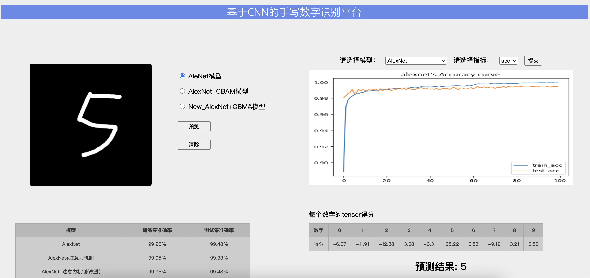

# torch_mnist_flask

## 主要的依赖包
1.torch
2.torchvision
3.flask

## 使用方法
- 1.clone本git，然后下载MNIST数据集，MNIST文件夹解压到DataSet目录下 （Download DataSet by Baidu Netdisk，The MNIST folder is extracted into the DataSet directory）

链接：https://pan.baidu.com/s/13yaI3R4Oun2UF0eoLpLfeQ 
提取码：vnyc 

## 网页设计参考 refer to
https://github.com/ybsdegit/Keras_flask_mnist

## 博客link
https://blog.csdn.net/qq_33952811/article/details/110227932

## demo

